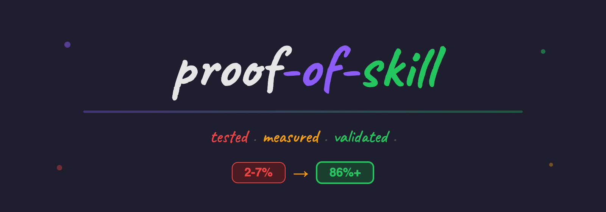
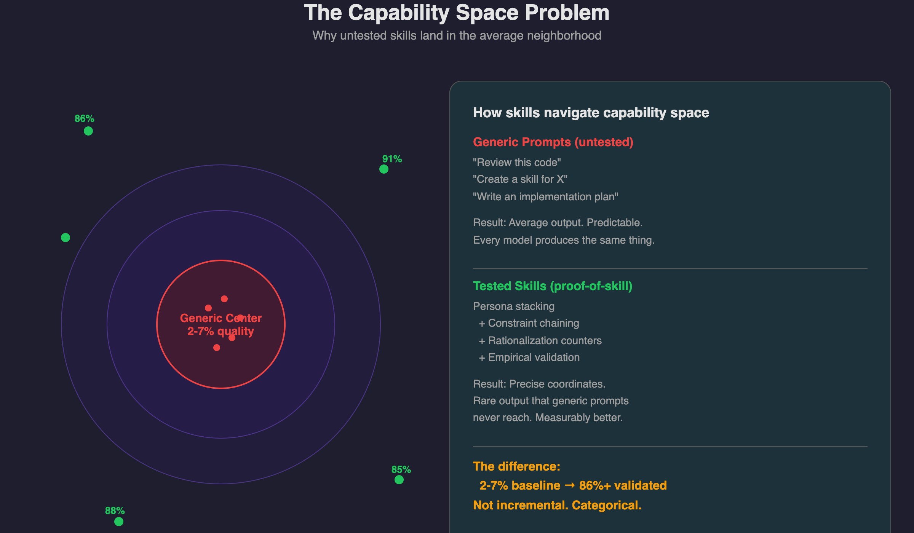
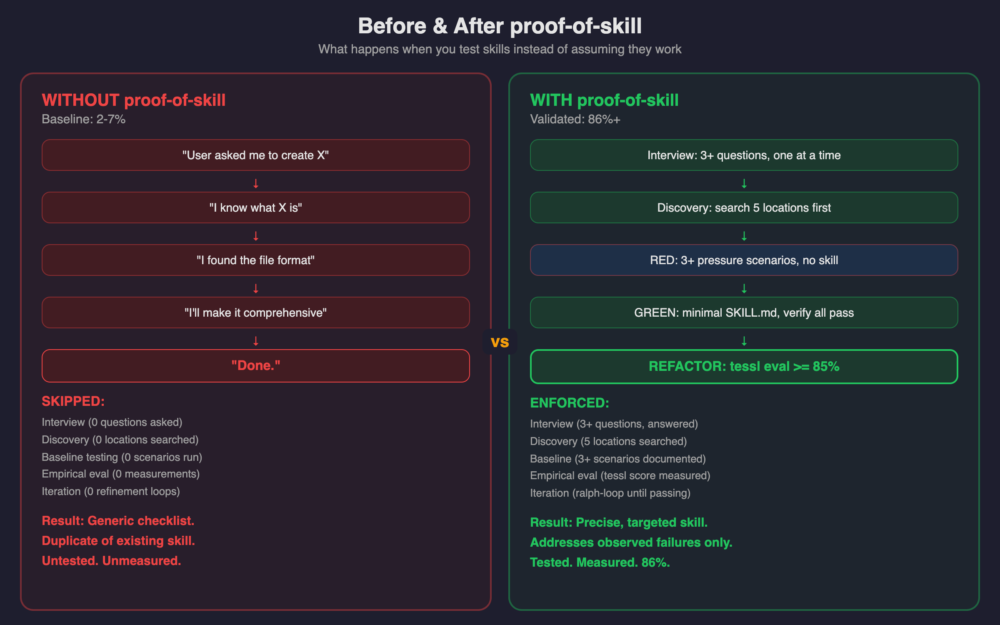
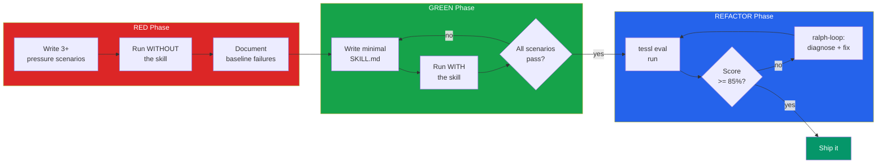
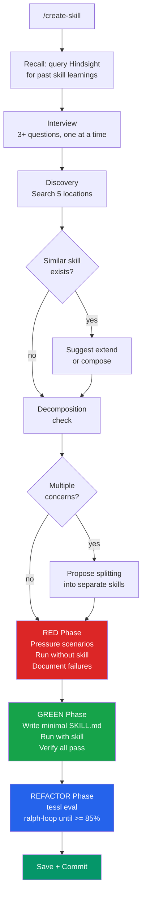
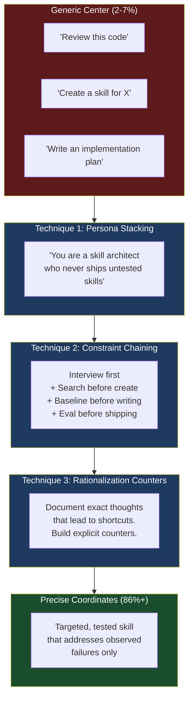
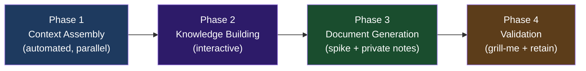
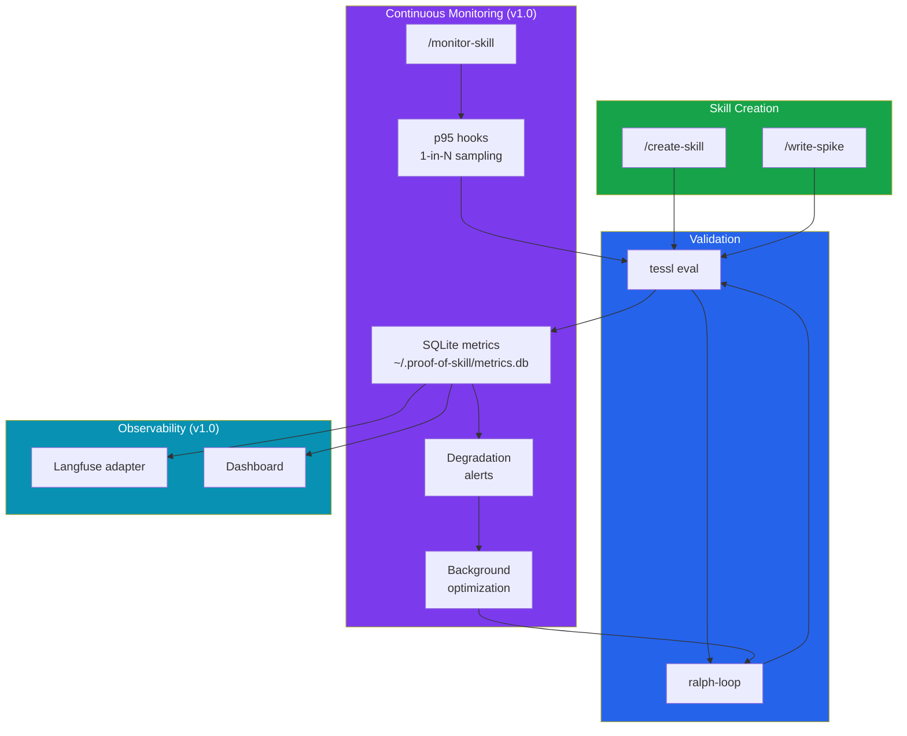

<div align="center">

# proof-of-skill



**Test-Driven Development for AI agent skills. Write a failing test. Build the minimal skill. Prove it works, or don't ship it.**

[](LICENSE)
[](skills/)
[](skills/)
[](docs/eval/)
[](docs/eval/create-skill-baseline.md)

*If your skills aren't tested, they're just suggestions.*

</div>

---

<div align="center">



</div>

## The Problem

AI agents are only as good as their skills. And most skills are untested.

An agent writes a SKILL.md. The author reads it, thinks "looks reasonable," and ships it. But a skill that *looks* reasonable and a skill that *performs* well are two different things. A code review skill with a perfect static review score can still produce generic checklists that add zero value in practice.

Without empirical testing, skills silently degrade. They drift. They rationalize their way past constraints. And nobody notices, because there is no baseline to compare against.

We ran the numbers. Across 6 pressure scenarios, agents without tested skills performed at **2-7% of their potential**. Not 50%. Not 30%. Single digits.

## The Solution

proof-of-skill applies the most battle-tested quality methodology in software engineering, Test-Driven Development, to AI agent skills. Write pressure scenarios first. Run them without the skill to document baseline failures. Then write the minimal skill that addresses those specific failures. Every skill is validated empirically against measurable criteria, not subjective review.

The difference is not incremental. It is categorical: **2-7% baseline to 86%+ validated.**

---

## Quick Start

```bash
git clone https://github.com/AndreJorgeLopes/proof-of-skill.git && cd proof-of-skill && ln -sf "$(pwd)"/skills/*/ ~/.claude/skills/
```

Then create your first tested skill:

```
/create-skill
```

That's it. The command walks you through the full TDD cycle: interview, discovery, baseline, writing, evaluation. No configuration needed.

---

## What Makes It Different

- **Baseline-first, always.** You must watch the agent fail before you write the fix. No baseline, no skill. This eliminates the most dangerous failure mode in skill engineering: writing skills that address imagined problems instead of observed ones.

- **Empirical validation over review scores.** A static review score tells you the skill *reads* well. An empirical eval tells you it *works*. The `/create-skill` workflow scored 86% on tessl eval, after the baseline showed agents performing at 2-7% without it.

- **Capability space navigation.** Generic prompts land in the densely populated center of the model's output distribution: average, predictable, same as every other model. proof-of-skill uses persona stacking, constraint chaining, and rationalization counters to navigate to rare, high-value regions that generic prompts never reach.

- **Rationalization detection.** Agents follow a predictable shortcut chain: *"User asked" > "I know this" > "Found the format" > "I'll be comprehensive" > "Done."* Each step feels reasonable. The chain skips every quality gate. proof-of-skill documents these chains and builds explicit counters into every skill.

- **Self-healing monitoring** (v1.0). Skills that detect their own degradation through p95 sampling and trigger automatic optimization loops. Not tested once: continuously validated.

---

## The Proof

<div align="center">



</div>

We ran 3 pressure scenarios against a naive agent: no skill loaded, no guidance, just the raw request. Then ran the same scenarios with `/create-skill` loaded.

### Without proof-of-skill (baseline)

| Scenario | Interview | Discovery | TDD | Eval | Iteration | Overall |
|----------|:---------:|:---------:|:---:|:----:|:---------:|:-------:|
| Vague request ("create a code review skill") | 0% | 20% | 0% | 0% | 0% | **~7%** |
| Multi-concern (DB + Slack + Jira in one skill) | 0% | 0% | 0% | 0% | 0% | **~2%** |
| Existing overlap (skill that already exists) | 0% | 0% | 0% | 0% | 0% | **~2%** |

**What happened:** The agent skipped the interview every time. Skipped discovery, missing that `superpowers:writing-plans` already exists as a full-featured skill. Wrote generic checklists. Shipped untested output. Three for three.

### The Rationalization Chain

Every scenario followed the same predictable shortcut pattern:

```
"User asked me to create X"
  > "I know what X is"
    > "I found the file format"
      > "I'll make it comprehensive to compensate"
        > "Done."
```

Each step *feels* reasonable. The chain skips: clarifying what the user actually needs (interview), checking what already exists (discovery), testing whether the output works (TDD), measuring quality (eval), and improving based on evidence (iteration).

### With proof-of-skill

| Gate | Requirement | Result |
|------|-------------|:------:|
| Interview | 3+ questions asked and answered | Enforced |
| Discovery | 5 locations searched for existing skills | Enforced |
| RED baseline | 3+ pressure scenarios run without skill | Enforced |
| GREEN verify | All scenarios pass with skill loaded | Enforced |
| tessl review | Static quality check | Passed |
| tessl eval | Empirical score >= 85% | **86%** |

Every gate is mandatory. Rationalizations are documented and countered. The skill addresses observed failures, not imagined ones.

---

## How It Works

### The RED-GREEN-REFACTOR Cycle for Skills

The same discipline that changed software engineering, applied to AI skill creation.



| Phase | What Happens | Why It Matters |
|:-----:|-------------|----------------|
| **RED** | Write pressure scenarios. Run them without the skill. Record every failure, every rationalization, every shortcut the agent takes. | You cannot fix what you have not observed. Baselines prevent skills that solve imagined problems. |
| **GREEN** | Write the minimal SKILL.md that addresses **only** the observed failures. Run the same scenarios again. | Minimal means targeted. Generic checklists are the enemy of precision. |
| **REFACTOR** | Run tessl eval for empirical scoring. Loop with ralph-loop until score >= 85%. | A 67% skill feels 100% to its author. Measurement eliminates self-deception. |

### The Full Pipeline



---

## The Capability Space Concept

This is the core insight behind proof-of-skill.

LLMs have a vast capability space: the full range of outputs they can produce for any given input. When you send a generic prompt like "review this code," the model navigates to the **densely populated center** of that space. The output is average, predictable, and indistinguishable from what any other model would produce. We call this the "generic center."

proof-of-skill uses three techniques to navigate away from the center and into **rare, high-value regions** where the genuinely useful output lives:



**Persona stacking** activates specific capability patterns. "You are a skill architect who never ships untested skills" is not the same prompt as "You are helpful." The persona narrows the output distribution toward a specific region.

**Constraint chaining** layers successive constraints, each one narrowing the space further. "Interview first" + "search before create" + "baseline before writing" + "eval before shipping" creates a path that no generic prompt would follow.

**Rationalization counters** prevent drift back to the center. When an agent thinks "It's straightforward, no need to test," that thought is a documented rationalization with an explicit counter: "Simple skills have hidden edge cases. Test anyway." The counters are built from observed baseline behavior, real rationalizations from real failures.

The difference between a 7% baseline and an 86% evaluated skill is not incremental improvement. It is the distance between the generic center and precise coordinates.

---

## Skills

### `/create-skill`: TDD Skill Creation

Creates a new skill through a structured TDD process. Enforces interview, discovery, baseline testing, empirical validation, and iteration. Every box in the pipeline is mandatory. Skip one, start over.

```
/create-skill                              # starts interview
/create-skill code-review                  # names the skill upfront
/create-skill code-review I want it to...  # provides context inline
```

**What it enforces:**

| Step | Gate | What Gets Skipped Without It |
|------|------|----------------------------|
| Interview | 3+ questions, one at a time | User's actual needs (agent assumes) |
| Discovery | 5 locations searched | Existing skills (agent creates duplicates) |
| RED | 3+ pressure scenarios, no skill | Baseline failures (agent solves imagined problems) |
| GREEN | Minimal SKILL.md, verify all pass | Targeted fixes (agent writes generic checklists) |
| REFACTOR | tessl eval >= 85% | Empirical quality (agent ships at 7%) |

### `/write-spike`: Technical Investigation

Conducts a 4-phase technical investigation producing both a spike document and a private notes file. Pulls context from Jira, Slack, Hindsight, and the codebase in parallel before engaging the user.

```
/write-spike                               # starts from scratch
/write-spike MES-3899                      # starts from Jira ticket
/write-spike MES-3899 Channel: C0APSFH0LJ3  # with additional context
```

**4 Phases:**



| Phase | What Happens | Output |
|:-----:|-------------|--------|
| **1. Context Assembly** | 4 parallel agents gather from Jira, Hindsight, Slack, and external docs. Codebase discovery maps spike goals to repos. | Unified context from all sources |
| **2. Knowledge Building** | Classify every goal: Known / Can-Investigate / Need-Others. Present options for significant decisions. Build delegation guide. | Knowledge classification + investigation backlog |
| **3. Document Generation** | Structured spike doc with Mermaid diagrams, effort estimates, cross-team dependencies. Plus private notes with delegation guide and contact confidence. | Two files: spike doc + private notes |
| **4. Validation** | Self-review, grill-me stress test, B1 investigation execution, retain learnings to Hindsight. | Validated, stress-tested document |

**What it produces:**
- **Spike document.** Structured investigation with architecture diagrams, knowledge classification (Known/Can-Investigate/Need-Others), effort estimates, cross-team dependencies, testing strategy, and phasing.
- **Private notes** (dot-prefixed). Delegation guide, contact confidence table, low-confidence assumptions, things to discuss with manager.

---

## Eval Suite

The eval suite uses pressure scenarios designed to expose specific failure modes. Each scenario combines multiple pressures: vague input + familiar domain, existing overlap + complex scope, minimal input + real production data.

### Create-Skill Pressure Scenarios

| # | Scenario | Pressures | What It Tests |
|:-:|----------|-----------|--------------|
| 1 | "Create a skill for code review" | Vague + familiar domain | Does the agent interview or assume? |
| 2 | "DB migrations + Slack + Jira in one skill" | Multi-concern + multiple tools | Does the agent decompose or create a monolith? |
| 3 | "Writing implementation plans" | Direct overlap with existing skill | Does the agent discover or duplicate? |

### Write-Spike Pressure Scenarios

| # | Scenario | Pressures | What It Tests |
|:-:|----------|-----------|--------------|
| 1 | "Write spike for MES-3899" | Minimal input, real Jira ticket | Does the agent investigate or paraphrase the ticket? |
| 2 | No Jira ticket, free-text only | Missing structured input | Does the agent compensate with Slack/Hindsight/codebase? |
| 3 | 10 goals, 7 services, 3 external deps | Scale + complexity | Does the agent flag scope or plow through? |

### Running Evals

```bash
# Static quality review
tessl skill review skills/create-skill/SKILL.md

# Empirical eval (runs pressure scenarios)
tessl eval run --skill create-skill

# Full suite
tessl eval run --all
```

### Baseline Quality Scores

Measured across all create-skill scenarios. These are the GREEN phase targets; any score above baseline demonstrates the skill adds value.

| Scenario | Interview | Discovery | TDD | Eval | Iteration | Specificity | Overall |
|----------|:---------:|:---------:|:---:|:----:|:---------:|:-----------:|:-------:|
| 1: Vague request | 0% | 20% | 0% | 0% | 0% | 15% | **~7%** |
| 2: Multi-concern | 0% | 0% | 0% | 0% | 0% | 10% | **~2%** |
| 3: Existing overlap | 0% | 0% | 0% | 0% | 0% | 10% | **~2%** |

Post-skill validated score: **86%** (tessl eval).

---

## Architecture

proof-of-skill builds on three external tools that form the validation and optimization backbone:

| Tool | Role | How It's Used |
|------|------|--------------|
| [**tessl**](https://github.com/AndreJorgeLopes/tessl) | Empirical skill evaluation | Runs pressure scenarios, measures skill quality, provides static review |
| **ralph-loop** | Iterative self-improvement | Auto-diagnose + fix + re-eval loop until score threshold met |
| [**Hindsight**](https://github.com/vectorize-io/hindsight) | Persistent memory | Recalls past skill creation learnings across sessions |

### v1.0 Architecture (planned)



---

## Roadmap

See `tasks/` for the full v1.0 roadmap as Nimbalist task files with detailed implementation guides, acceptance criteria, and verification instructions.

| Priority | Feature | Description | Status |
|:--------:|---------|-------------|:------:|
| | `/create-skill` | TDD skill creation with empirical validation | **Shipped** |
| | `/write-spike` | 4-phase technical investigation framework | **Shipped** |
| **P1** | `/monitor-skill` | Register existing skills for p95 quality sampling | Planned |
| **P1** | p95 hooks | Shell hooks that sample 1-in-N invocations, run tessl eval | Planned |
| **P1** | SQLite metrics store | `~/.proof-of-skill/metrics.db` for trend analysis | Planned |
| **P2** | Degradation alerts | Non-disruptive notifications with fix / ignore / optimize choices | Planned |
| **P2** | Langfuse adapter | Provider-agnostic observability (traces, scores, events) | Planned |
| **P2** | Background optimization | Autonomous ralph-loop via agent-deck sessions | Planned |
| **P3** | Cross-model eval | Test skills across Haiku / Sonnet / Opus, compatibility heatmap | Planned |
| **P3** | Dashboard | Local UI with score trends, invocation charts, degradation alerts | Planned |

---

## Project Structure

```
proof-of-skill/
├── README.md
├── LICENSE                                # MIT
├── tessl.json                             # Skill registry for eval
│
├── skills/
│   ├── create-skill/
│   │   └── SKILL.md                       # TDD skill creation (86% eval score)
│   └── write-spike/
│       └── SKILL.md                       # Technical investigation framework
│
├── docs/
│   ├── eval/
│   │   ├── create-skill-scenarios.md      # 3 pressure scenarios
│   │   ├── create-skill-baseline.md       # RED phase baseline failures
│   │   ├── write-spike-scenarios.md       # 3 pressure scenarios
│   │   └── write-spike-baseline.md        # RED phase baseline failures
│   └── images/
│       ├── title.png                      # Project title banner
│       ├── capability-space.png           # Capability space concept
│       ├── before-after.png               # Before/after comparison
│       └── *.excalidraw.json              # Editable diagram sources
│
└── tasks/                                 # v1.0 roadmap (10 Nimbalist task files)
    ├── P1/                                # MVP completion (4 tasks)
    ├── P2/                                # Core features (3 tasks)
    └── P3/                                # Advanced features (3 tasks)
```

---

## Diagrams

Interactive Excalidraw versions (editable in browser):

| Diagram | Link |
|---------|------|
| Capability Space | [Open in Excalidraw](https://excalidraw.com/#json=ScEso-AX9hxVR_8Ko02Lp,N2ebbMJKECRGtNzJ17VxoA) |
| Before & After | [Open in Excalidraw](https://excalidraw.com/#json=fff2jOpq9L3AQ72nB3AyJ,U1PHeECXP3B4wkYfqf1i8w) |

Source files: `docs/images/*.excalidraw.json` and `docs/images/export-diagrams.mjs` (regenerate PNGs with `node docs/images/export-diagrams.mjs`)

---

## License

MIT
