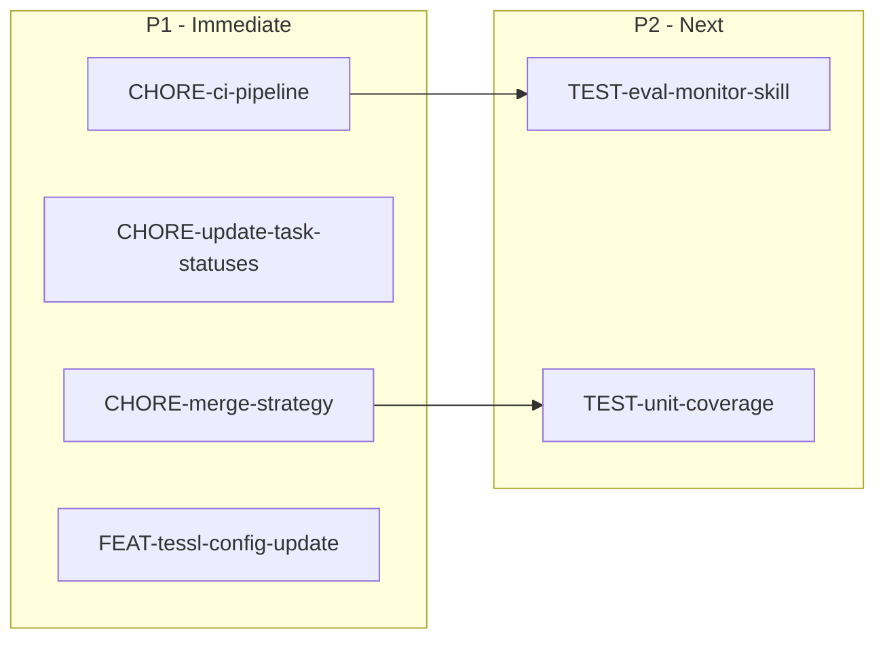
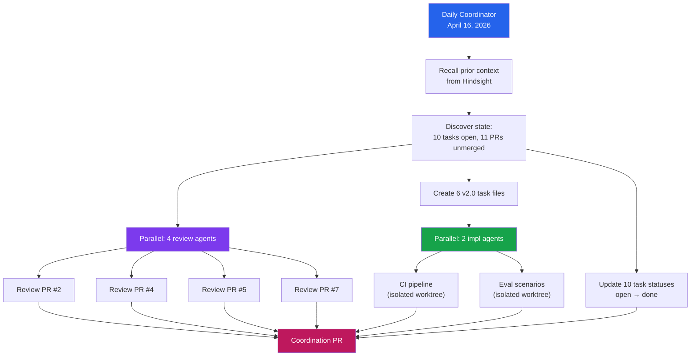

# Autonomous Coordination Run — April 16, 2026

## TL;DR

Daily autonomous coordination run on proof-of-skill. Found all 10 v1.0 tasks completed (PRs #2-#11 open but unmerged). Updated task statuses, created 6 v2.0 tasks, spawned review+implementation agents. Produced CI pipeline PR, eval scenarios PR, and this coordination summary.

## Current State Analysis

### v1.0 Status: All Tasks Complete, PRs Pending Merge

All 10 original tasks from the v1.0 roadmap have been implemented with open PRs. None have been merged to main yet. The task files on main still showed `status: open` — this run corrected that.

| Priority | Tasks | PRs | Status |
|----------|-------|-----|--------|
| P1 (4) | monitor-skill, p95-hooks, sqlite-store, readme | #2, #4, #5, main | All done |
| P2 (3) | notifier, langfuse, optimizer | #7, #8, #9 | All done |
| P3 (3) | contributing, cross-model-eval, dashboard | #3, #10, #11 | All done |

### PR Health Check

| PR | Title | Mergeable | Lines |
|----|-------|-----------|-------|
| #1 | ImgBot optimize images | MERGEABLE | — |
| #2 | /monitor-skill | MERGEABLE | +348 |
| #3 | CONTRIBUTING.md | MERGEABLE | +360 |
| #4 | p95 hooks | MERGEABLE | +333 |
| #5 | SQLite store | UNKNOWN | +1788 |
| #6 | Coordination (v1) | — | — |
| #7 | Notifier | MERGEABLE | +1716 |
| #8 | Langfuse adapter | MERGEABLE | +1603 |
| #9 | Background optimize | UNKNOWN | +498 |
| #10 | Cross-model eval | MERGEABLE | +549 |
| #11 | Dashboard | UNKNOWN | +1251 |

PRs #5, #9, #11 show UNKNOWN mergeability due to branch dependency chains.

## Actions Taken

### 1. Task Status Update
Updated all 10 v1.0 task files from `status: open` to `status: done` with PR references.

### 2. v2.0 Task Creation (6 new tasks)

| Task ID | Priority | Description | Status |
|---------|----------|-------------|--------|
| CHORE-ci-pipeline | P1 | GitHub Actions CI for PR validation | In Progress (PR pending) |
| CHORE-update-task-statuses | P1 | Update v1.0 task statuses | Done (this PR) |
| CHORE-merge-strategy | P1 | Document PR merge order | Done (task file) |
| FEAT-tessl-config-update | P1 | Add monitor-skill to tessl.json | In Progress (PR pending) |
| TEST-eval-monitor-skill | P2 | Eval scenarios for /monitor-skill | In Progress (PR pending) |
| TEST-unit-coverage | P2 | Unit tests for TypeScript modules | Open (future) |

### 3. PR Reviews
Ran devflow:review on PRs #2, #4, #5, #7 to identify improvement opportunities.

### 4. Implementation Agents Completed
- CI pipeline agent: **PR #12** — `.github/workflows/ci.yml` (+80 lines)
- Eval scenarios agent: **PR #13** — `docs/eval/monitor-skill-scenarios.md` + tessl.json update (+106/-1 lines)

## Coordination Flow

## Recommended Merge Order

See [CHORE-merge-strategy](../tasks/v2/CHORE-merge-strategy.md) for the full dependency-aware merge plan.

**Summary:** Merge Wave 1 (PRs #1, #2, #3, #7, #8) first — they're all independent and MERGEABLE. Then #4 → #5 → (#9, #10, #11) → #6.

## Key Gaps Identified

1. **No CI pipeline** — **fixed** by PR #12
2. **No unit tests** — TEST-unit-coverage task created for future
3. **No eval scenarios for monitor-skill** — **fixed** by PR #13
4. **tessl.json missing monitor-skill** — **fixed** by PR #13
5. **PRs #5, #9, #11 may need rebasing** after Wave 1 merges

## New PRs Created This Run

| PR | Title | Lines | Agent |
|----|-------|-------|-------|
| [#12](https://github.com/AndreJorgeLopes/proof-of-skill/pull/12) | CI pipeline | +80 | impl-ci-pipeline |
| [#13](https://github.com/AndreJorgeLopes/proof-of-skill/pull/13) | Eval scenarios for /monitor-skill | +106/-1 | impl-eval-scenarios |
| [#14](https://github.com/AndreJorgeLopes/proof-of-skill/pull/14) | This coordination PR | +422/-10 | coordinator |

## Review Findings Summary

Reviews of PRs #2, #4, #5, #7 were dispatched to 4 parallel review agents. Findings will be added as PR comments on each respective PR.
