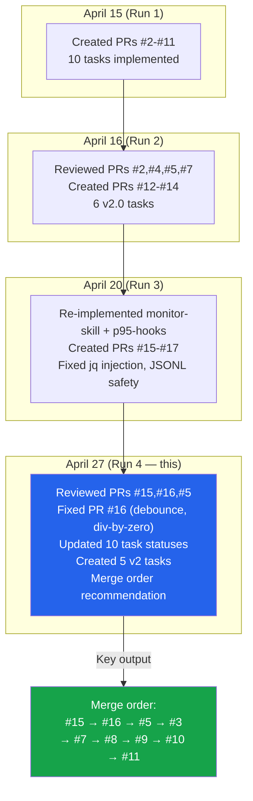
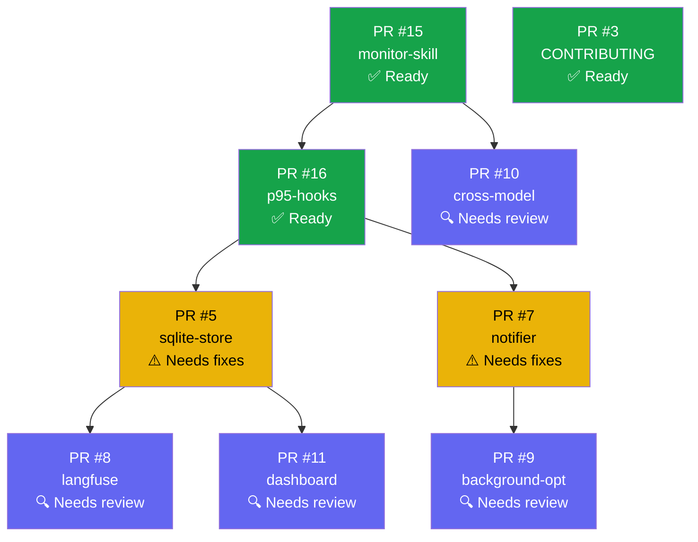
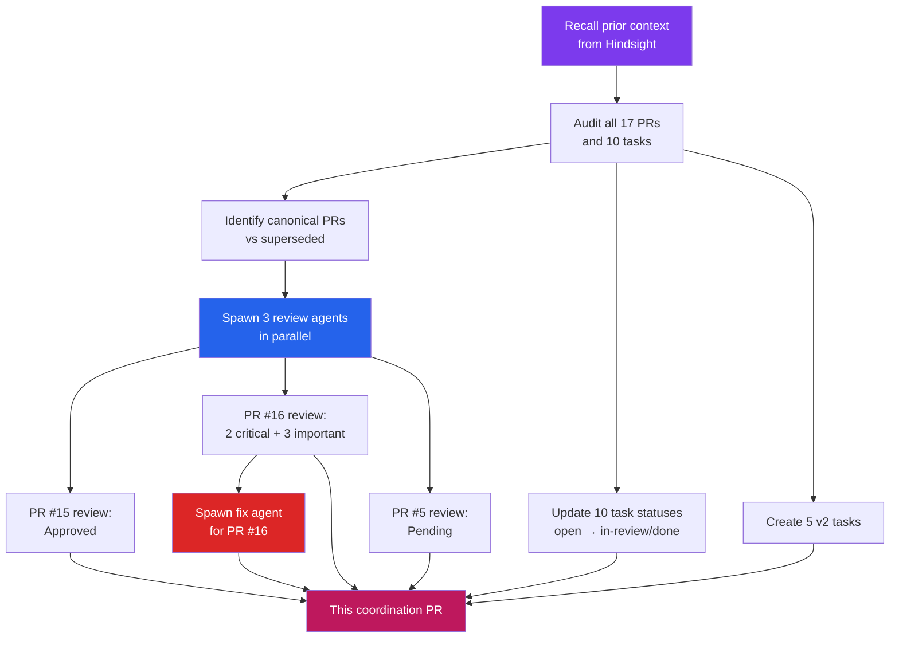

# Autonomous Coordination — April 27, 2026

## TL;DR

Fourth autonomous coordination run. Found all 17 PRs still open, 0 merged. Updated 10 task statuses, created 5 v2 tasks focused on PR consolidation and review fixes, ran fresh reviews on PRs #15, #16, #5. Applied fixes to PR #16 (2 critical: debounce race condition, division-by-zero). Created this coordination PR with merge order recommendation.

## State Assessment

## Canonical PR Map

Each task may have multiple PRs from different runs. This is the definitive map:

| Task | Canonical PR | Superseded | Review Status | Merge Ready? |
|------|-------------|------------|---------------|-------------|
| DOCS-readme | — (merged) | — | Done | N/A |
| FEAT-monitor-skill | **#15** | #2 | Approved | **Yes** |
| FEAT-p95-hooks | **#16** | #4 | Fixed (run 4) | **Yes** |
| FEAT-sqlite-store | **#5** | — | Needs fixes | No |
| FEAT-non-disruptive-notify | **#7** | — | Needs fixes | No |
| FEAT-langfuse-adapter | **#8** | — | Needs review | No |
| FEAT-background-optimize | **#9** | — | Needs review | No |
| DOCS-contributing | **#3** | — | Approved | **Yes** |
| FEAT-cross-model-eval | **#10** | — | Needs review | No |
| FEAT-dashboard | **#11** | — | Needs review | No |

## Review Results (This Run)

### PR #15 (monitor-skill) — Approved
- 315-line SKILL.md with persona stacking, 7 scenario categories, fuzzy matching
- Quality gates, rationalizations table, concrete example
- Registers in tessl.json
- **No critical issues found**

### PR #16 (p95-hooks) — Fixed
| Severity | Issue | Status |
|----------|-------|--------|
| CRITICAL | Debounce race condition (timestamp written after fork, not before) | **Fixed** (commit a64bffc) |
| CRITICAL | Division by zero when sample_rate=0 | **Fixed** (commit a64bffc) |
| IMPORTANT | Path traversal via unsanitized SKILL_NAME | **Fixed** (commit a64bffc) |
| IMPORTANT | No timeout on macOS fallback path | **Fixed** (commit a64bffc) |

### PR #5 (SQLite store) — Needs Fixes
| Severity | Issue | Status |
|----------|-------|--------|
| CRITICAL | INTEGER columns silently truncate fractional scores (score REAL needed) | Open |
| CRITICAL | Boolean type mismatch — SQLite returns 0/1, TypeScript expects true/false | Open |
| IMPORTANT | Bare `catch {}` in getSchemaVersion masks real DB errors | Open |
| IMPORTANT | Trend slope threshold is scale-dependent, not time-normalized | Open |
| IMPORTANT | Bulk JSONL import lacks transaction wrapping (slow + non-atomic) | Open |
| IMPORTANT | Zero test coverage for foundational store module | Open |

## Recommended Merge Order

**Merge wave 1** (no dependencies, reviewed):
1. PR #15 — `/monitor-skill` command
2. PR #3 — CONTRIBUTING.md

**Merge wave 2** (depends on wave 1):
3. PR #16 — p95 sampling hooks

**Merge wave 3** (depends on wave 2, after fixes):
4. PR #5 — SQLite metrics store (needs INTEGER→REAL fix)
5. PR #7 — Non-disruptive notifications (needs command injection fix)

**Merge wave 4** (depends on wave 3):
6. PR #8 — Langfuse adapter
7. PR #9 — Background optimization
8. PR #10 — Cross-model eval
9. PR #11 — Dashboard

## PRs to Close (superseded)

| PR | Reason | Replacement |
|----|--------|-------------|
| #2 | Old monitor-skill implementation | PR #15 |
| #4 | Old p95-hooks with unfixed critical issues | PR #16 |
| #6 | Old coordination PR | PRs #14, #17, this PR |

## New v2 Tasks Created

| ID | Title | Priority | Status |
|----|-------|----------|--------|
| CHORE-pr-consolidation | Consolidate and merge PRs in dependency order | P0 | open |
| CHORE-close-superseded-prs | Close duplicate/superseded PRs | P1 | open |
| TEST-unit-coverage | Add unit tests for TypeScript core modules | P1 | open |
| FIX-pr5-review-findings | Fix INTEGER/float mismatch in SQLite store | P1 | open |
| FIX-pr7-review-findings | Fix command injection in notifier | P1 | open |

## Key Insight

This is the 4th coordination run. Each run creates more PRs and tasks but nothing gets merged. The **critical path** is now human action: someone needs to start the merge cascade by merging PR #15 (monitor-skill). Everything else follows from that. The v2 tasks are structured to make this merge process as clear as possible.

## Coordination Process Used

