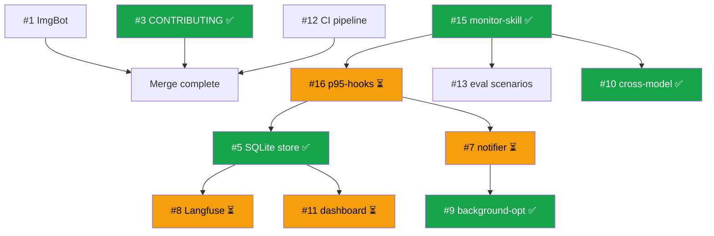
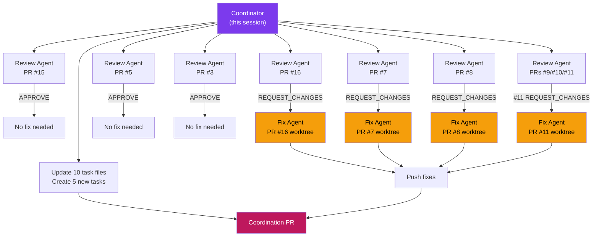

# Coordination Run — May 11, 2026

## Summary

Sixth autonomous coordination run. Reviewed all 9 feature PRs (7 parallel review agents), identified issues in 4 PRs, dispatched 4 parallel fix agents, updated all 10 task statuses, and created 5 new follow-up tasks based on review findings and research into autonomous coordination best practices (GNAP pattern).

## Review Results

| PR | Task | Status | Key Finding |
|----|------|--------|-------------|
| #15 | FEAT-monitor-skill | **APPROVE** | All 11 criteria met |
| #5 | FEAT-sqlite-store | **APPROVE** | All 12 criteria met, minor suggestions |
| #3 | DOCS-contributing | **APPROVE** | All 11 criteria met |
| #9 | FEAT-background-optimize | **APPROVE** | In-memory tracking fragile |
| #10 | FEAT-cross-model-eval | **APPROVE** | Sync in async method |
| #16 | FEAT-p95-hooks | **REQUEST_CHANGES** | Tmpfile race, missing install script |
| #8 | FEAT-langfuse-adapter | **REQUEST_CHANGES** | No dual-write in MetricsStore |
| #7 | FEAT-non-disruptive-notify | **REQUEST_CHANGES** | NO_COLOR at import time |
| #11 | FEAT-dashboard | **REQUEST_CHANGES** | Near-miss logic inverted (CRITICAL) |

## Fixes Applied (May 11)

### PR #16 — p95-hooks
- Replace predictable `/tmp/tessl-eval-$$.out` with `mktemp`
- Use original `SKILL_NAME` in JSON output (not `SAFE_SKILL_NAME`)
- Add `--install` flag for hook registration in Claude Code settings

### PR #8 — Langfuse adapter
- Wire dual-write adapter calls in MetricsStore (fire-and-forget pattern)
- Add `close()` method that flushes adapter before closing DB

### PR #7 — notifier
- Replace module-level `useColor` constant with runtime function
- Make ANSI codes computed per-invocation (dynamic `getAnsi()`)

### PR #11 — dashboard
- Fix near-miss logic: `score >= threshold && score < threshold + margin` (was inverted)
- Add explicit path allowlist in HTTP server

## New Tasks Created

| ID | Priority | Effort | Origin |
|----|----------|--------|--------|
| FEAT-persist-optimization-sessions | P2 | S | PR #9 review |
| FEAT-async-cross-model-eval | P2 | S | PR #10 review |
| FEAT-data-retention | P3 | S | PR #5 review |
| FEAT-test-coverage | P3 | M | PRs #7, #8, #10 reviews |
| FEAT-gnap-coordination | P3 | M | Research — GNAP pattern |

## Task Status Map

### P1 — Core Features
| Task | Status | PR | Merge-Ready |
|------|--------|----|-------------|
| DOCS-readme | done | main | ✅ merged |
| FEAT-monitor-skill | reviewed | #15 | ✅ yes |
| FEAT-p95-hooks | fixing | #16 | ⏳ after fixes land |
| FEAT-sqlite-store | reviewed | #5 | ✅ yes |

### P2 — Enhancement Features
| Task | Status | PR | Merge-Ready |
|------|--------|----|-------------|
| FEAT-non-disruptive-notify | fixing | #7 | ⏳ after fixes land |
| FEAT-langfuse-adapter | fixing | #8 | ⏳ after fixes land |
| FEAT-background-optimize | reviewed | #9 | ✅ yes |
| FEAT-persist-optimization-sessions | open | — | new task |
| FEAT-async-cross-model-eval | open | — | new task |

### P3 — Nice-to-Have
| Task | Status | PR | Merge-Ready |
|------|--------|----|-------------|
| DOCS-contributing | reviewed | #3 | ✅ yes |
| FEAT-cross-model-eval | reviewed | #10 | ✅ yes |
| FEAT-dashboard | fixing | #11 | ⏳ after fixes land |
| FEAT-data-retention | open | — | new task |
| FEAT-test-coverage | open | — | new task |
| FEAT-gnap-coordination | open | — | new task |

## Recommended Merge Order (Updated)

**Unblocked and merge-ready now:** #1, #3, #12, #15
**Merge-ready after dependency:** #5, #9, #10
**Pending fixes (pushed May 11):** #7, #8, #11, #16

## Research: Autonomous Coordination Best Practices

Investigated GNAP (Git-Native Agent Protocol) and Agent Orchestrator patterns for multi-agent task coordination:

- **GNAP**: Uses 4 JSON files in git repo as persistent task board (todo/doing/done). No server needed — any agent that can `git push` participates. Created `FEAT-gnap-coordination` task to implement this.
- **Agent Orchestrator**: Spawns parallel agents in git worktrees with auto-CI-fix and reviewer comment handling. This is essentially what our coordination runs do manually.
- **Symbol-level locking**: Instead of file-level locks, use AST parsing to lock specific functions. More granular but heavier to implement.
- **Blackboard pattern**: Shared state where agents see each other's progress, conflicts arbitrated automatically. Similar to our task file approach but more structured.

## Agent Architecture This Run

Total agents spawned: **11** (7 review + 4 fix), all running in parallel within their respective phases.
