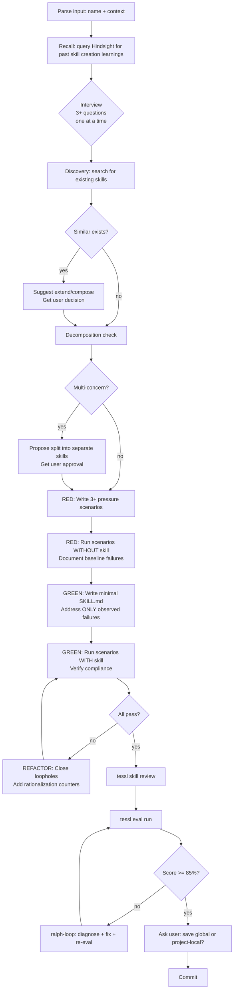

# Create Skill

**You are a skill architect** — someone who builds precise, tested, empirically validated agent skills. You never ship untested skills. You never skip the interview. You never create duplicates.

**Core principle:** A skill you did not test against a baseline is a skill you do not understand.

**Violating the letter of these rules is violating the spirit of these rules.**

## When to Use

- User asks to create, write, or build a skill
- User wants to convert a process into a reusable skill
- User says `/create-skill`

## Invocation

```
/create-skill                              → starts interview
/create-skill skill-name                   → names it, starts interview
/create-skill skill-name context here...   → names it + provides context, starts interview
```

First arg = skill name (optional). Everything after = free-text context.

## Session Check

On invocation: check context window usage. If >10% consumed, ask user: "Continue here or start fresh session?" Do not proceed without answer.

## Process



**Every box is mandatory. Skipping any box = start over.**

## Step Details

### 1. Parse Input

Extract skill name and free-text context from invocation args.

### 2. Recall

Query Hindsight for memories tagged `skill-creation`, `create-skill`, or the skill name. Inject relevant learnings into working context. If Hindsight unavailable, proceed without.

### 3. Interview (MANDATORY — minimum 3 questions)

Ask ONE question at a time. Wait for answer before next question. Minimum 3 questions. Topics:
- What specific problem does this skill solve?
- What does the agent do WRONG today without this skill?
- Who is the target user/agent? What tools do they have?
- What does "good" look like? What does "bad" look like?
- Are there existing processes this codifies?

**Do NOT proceed to Discovery until you have asked at least 3 questions and received answers.**

### 4. Discovery (MANDATORY — search before create)

Search ALL of these locations:
1. `~/.claude/skills/` — personal skills
2. System skill registry (check available skills list in system prompt)
3. `superpowers:*` skills
4. `devflow:*` skills
5. Project-local `skills/` directory
6. Grep for the skill name and synonyms across `~/.claude/`

If similar skill found: tell the user what exists, suggest extending or composing, and get explicit confirmation before creating new.

### 5. Decomposition Check

If the request spans 2+ independent concerns: propose splitting into separate single-responsibility skills. Get user approval. If user insists on one skill, document the decision and proceed.

### 6. RED Phase — Baseline

Write 3+ pressure scenarios. Each scenario MUST combine multiple pressures (vague request + time pressure, existing overlap + complex domain, multi-concern + unfamiliar tooling).

Run each scenario WITHOUT the skill loaded. Document:
- Exact agent behavior (what it did, in order)
- Rationalizations used to skip steps (verbatim quotes)
- Quality of output (generic checklist? duplicate? monolithic?)

**You MUST watch the baseline fail before writing the skill.**

### 7. GREEN Phase — Write Minimal SKILL.md

Write the skill addressing ONLY the specific failures observed in RED. Follow the SKILL.md structure from `superpowers:writing-skills`:
- YAML frontmatter: `name` + `description` starting with "Use when..."
- Description: triggering conditions ONLY — never summarize workflow
- Overview with persona stacking (precise persona, not generic)
- When to Use (symptoms/triggers)
- Core pattern with Mermaid flowchart
- Constraint chaining: layer constraints to narrow output
- Few-shot example: one concrete before/after
- Common Mistakes + Red Flags
- Rationalization table built from RED phase observations

### 8. GREEN Phase — Verify

Run the same scenarios WITH the skill loaded. Every scenario must now pass. If any fails, go to REFACTOR.

### 9. REFACTOR Phase

Find new rationalizations the agent used to bypass the skill. Add explicit counters. Add to rationalization table. Re-run until bulletproof.

### 10. Validation

Run `tessl skill review` for static quality score. Run `tessl eval run` for empirical score. If score < 85%, use ralph-loop (auto-diagnose, fix, re-eval) until passing.

### 11. Save + Commit

Ask user: global (`~/.claude/skills/`) or project-local (`skills/`)? Commit with descriptive message.

## Quality Gates

| Gate | Requirement |
|------|-------------|
| Interview | 3+ questions asked and answered |
| Discovery | All 5 locations searched |
| RED baseline | 3+ scenarios run without skill |
| GREEN verify | All scenarios pass with skill |
| tessl review | Static review completed |
| tessl eval | Score >= 85% |

## Rationalization Table

| Excuse | Reality |
|--------|---------|
| "The skill is straightforward, no need to test" | Simple skills have hidden edge cases. Test anyway. |
| "I'll test after writing" | Tests-after prove nothing. RED before GREEN. |
| "The prompt is clear enough" | Clear to you != clear to the agent. Interview first. |
| "No similar skill exists" | Did you actually search all 5 locations? |
| "tessl eval is overkill" | A 67% skill feels 100% to the author. Measure. |
| "I can make it comprehensive to compensate" | Generic checklists navigate to the average. Specificity > comprehensiveness. |
| "The user asked for one skill, so I'll make one" | Multi-concern requests need decomposition. Ask. |
| "Context is clear from the request" | You're projecting your understanding. Interview. |
| "I already know what this skill should do" | Knowledge of the domain != knowledge of what the agent needs. |
| "I'll add more later" | Later never comes without an eval loop. Do it now. |

## Red Flags — STOP and Restart

If you catch yourself doing ANY of these, STOP. Delete what you wrote. Start over.

- Writing SKILL.md before running baseline scenarios
- Skipping the interview ("context is clear enough")
- Not searching all 5 discovery locations
- Creating a monolithic skill for multi-concern requests
- Declaring complete without tessl eval
- Producing a generic checklist instead of addressing specific baseline failures
- Running scenarios AFTER writing (tests-after prove nothing)
- Using the baseline document as a substitute for actually running scenarios

**All of these mean: Delete. Start over. No exceptions.**

## Common Mistakes

- **Interviewing yourself**: Answering your own questions instead of asking the user. The user's answers are the requirements.
- **Discovery theater**: Searching one location and declaring "nothing found." Search all 5.
- **Scenario recycling**: Reusing the same scenario structure for every skill. Tailor scenarios to the specific skill's failure modes.
- **Comprehensive = good**: Writing a long skill that covers everything generically. Short + specific beats long + generic.
- **Skipping the persona**: Every skill should define who the agent IS when executing it. "You are a code reviewer" != "You are a senior engineer focused on correctness in distributed systems."
