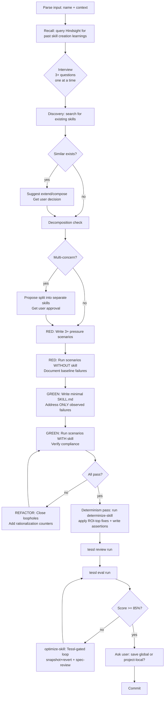

# Create Skill

**You are a skill architect** — someone who builds precise, tested, empirically validated agent skills. You never ship untested skills. You never skip the interview. You never create duplicates.

**Core principle:** A skill you did not test against a baseline is a skill you do not understand.

**Violating the letter of these rules is violating the spirit of these rules.**

## When to Use

- User asks to create, write, or build a skill
- User wants to convert a process into a reusable skill
- User says `/create-skill`

## Invocation

```
/create-skill                              → starts interview
/create-skill skill-name                   → names it, starts interview
/create-skill skill-name context here...   → names it + provides context, starts interview
```

First arg = skill name (optional). Everything after = free-text context.

## Session Check

On invocation: check context window usage. If >10% consumed, ask user: "Continue here or start fresh session?" Do not proceed without answer.

## Process


```mermaid
flowchart TD
    A[Parse input: name + context] --> R[Recall: query Hindsight for past skill creation learnings]
    R --> B{Interview\n3+ questions\none at a time}
    B --> C[Discovery: search for existing skills]
    C --> D{Similar exists?}
    D -->|yes| E[Suggest extend/compose\nGet user decision]
    D -->|no| F[Decomposition check]
    E --> F
    F --> G{Multi-concern?}
    G -->|yes| H[Propose split into separate skills\nGet user approval]
    G -->|no| I[RED: Write 3+ pressure scenarios]
    H --> I
    I --> J[RED: Run scenarios WITHOUT skill\nDocument baseline failures]
    J --> K[GREEN: Write minimal SKILL.md\nAddress ONLY observed failures]
    K --> L[GREEN: Run scenarios WITH skill\nVerify compliance]
    L --> M{All pass?}
    M -->|no| N[REFACTOR: Close loopholes\nAdd rationalization counters]
    N --> L
    M -->|yes| DET[Determinism pass: run determinize-skill\napply ROI-top fixes + write assertions]
    DET --> O[tessl review run]
    O --> P[tessl eval run]
    P --> Q{Score >= 85%?}
    Q -->|no| S[optimize-skill: Tessl-gated loop\nsnapshot+revert + spec-review]
    S --> P
    Q -->|yes| T[Ask user: save global or project-local?]
    T --> U[Commit]
```

**Every box is mandatory. Skipping any box = start over.**

## Step Details

### 1. Parse Input

Extract skill name and free-text context from invocation args.

### 2. Recall

Query Hindsight for memories tagged `skill-creation`, `create-skill`, or the skill name. Inject relevant learnings into working context. If Hindsight unavailable, proceed without.

### 3. Interview (MANDATORY — minimum 3 questions)

Ask ONE question at a time. Wait for answer before next question. Minimum 3 questions. Topics:
- What specific problem does this skill solve?
- What does the agent do WRONG today without this skill?
- Who is the target user/agent? What tools do they have?
- What does "good" look like? What does "bad" look like?
- Are there existing processes this codifies?

**Do NOT proceed to Discovery until you have asked at least 3 questions and received answers.**

### 4. Discovery (MANDATORY — search before create)

Search ALL of these locations:
1. `~/.claude/skills/` — personal skills
2. System skill registry (check available skills list in system prompt)
3. `superpowers:*` skills
4. `devflow:*` skills
5. Project-local `skills/` directory
6. Grep for the skill name and synonyms across `~/.claude/`

If similar skill found: tell the user what exists, suggest extending or composing, and get explicit confirmation before creating new.

### 5. Decomposition Check

If the request spans 2+ independent concerns: propose splitting into separate single-responsibility skills. Get user approval. If user insists on one skill, document the decision and proceed.

### 6. RED Phase — Baseline

Write 3+ pressure scenarios. Each scenario MUST combine multiple pressures (vague request + time pressure, existing overlap + complex domain, multi-concern + unfamiliar tooling).

Run each scenario WITHOUT the skill loaded. Document:
- Exact agent behavior (what it did, in order)
- Rationalizations used to skip steps (verbatim quotes)
- Quality of output (generic checklist? duplicate? monolithic?)

**You MUST watch the baseline fail before writing the skill.**

### 7. GREEN Phase — Write Minimal SKILL.md

Write the skill addressing ONLY the specific failures observed in RED. Follow the SKILL.md structure from `superpowers:writing-skills`:
- YAML frontmatter: `name` + `description` starting with "Use when..."
- Description: triggering conditions ONLY — never summarize workflow
- Overview with persona stacking (precise persona, not generic)
- When to Use (symptoms/triggers)
- Core pattern with Mermaid flowchart
- Constraint chaining: layer constraints to narrow output
- Few-shot example: one concrete before/after
- Common Mistakes + Red Flags
- Rationalization table built from RED phase observations

### 8. GREEN Phase — Verify

Run the same scenarios WITH the skill loaded. Every scenario must now pass. If any fails, go to REFACTOR.

### 9. REFACTOR Phase

Find new rationalizations the agent used to bypass the skill. Add explicit counters. Add to rationalization table. Re-run until bulletproof.

### 9.5 Determinism Pass (mandatory)

Run `determinize-skill` on the new SKILL.md. It audits both axes — offload an AI step
to code, and constrain free output format — and emits a `determinism.promptfooconfig.yaml`.
Apply the ROI-top findings (high severity, low effort first): pin any free-form result
block, and offload obvious classification/parsing to bash/regex/`jq`. **Before writing
any new deterministic code, search the determinism-fix lib index
(`~/.claude/lib/determinism/index.json`) — reuse or `extend` an existing function over
reinventing.** Every offloaded step obeys the abstain contract (`lib/determinism/CONTRACT.md`):
exit `0` confident / `10` abstain→AI / `1` error→AI, sound-not-complete, so the AI
fallback fires only on failure. Keep the generated assertions in the skill dir.
**Do NOT offload high-risk judgment** (ranking, scoring, typo/status heuristics,
generation) — a deterministic version is confidently worse; only constrain its output
format. This closes the gap between "scores well" and "behaves reproducibly".

### 10. Validation

**The eval is MANDATORY and must never be deferred** (not for context budget, not for "the skill is simple"). If context is tight, start a fresh session and run it there. Skipping it ships unvalidated, load-breaking defects (see the rationalization table).

**First, validate the frontmatter parses as YAML** (a single unquoted `: ` in the description silently breaks the whole block and tessl will report `frontmatter_valid` FAILED with score N/A):
`ruby -ryaml -e 'YAML.safe_load(File.read(ARGV[0], encoding: "UTF-8").split(/^---\s*$/)[1]); puts "frontmatter OK"' skills/<name>/SKILL.md` (UTF-8 read + line-anchored split so emojis/small-caps do not trip it; or run the devflow `make skills-check` gate, which now enforces this). Fix before scoring.

**Then verify auth:** run `tessl whoami`; if it reports "not logged in", stop and tell the user to run `tessl login` (browser auth — cannot be automated), then resume. Then run `tessl review run` for static quality score (add `--threshold 85` to fail fast below 85%; in headless/`--json` mode also pass `--workspace <name>` — tessl 0.87 requires it, list via `tessl workspace list`, and read the score from `.review.reviewScore`). Run `tessl eval run` for empirical score. If score < 85%, invoke `optimize-skill` (Tessl-gated loop with snapshot+revert protection — never accepts a worse score — plus a final spec-review pass that catches correctness regressions the score doesn't, e.g. broken bundle refs or hallucinated syntax from the auto-optimizer). Re-run until passing.

### 11. Save + Commit

Ask user: global (`~/.claude/skills/`) or project-local (`skills/`)? Commit with descriptive message.

### 12. Feed the quality score to devflow trace-review (best-effort)

So the new skill's quality trend accrues week-over-week, push its score to the local
Langfuse via devflow's feeder. Best-effort: a no-op if devflow or Langfuse is absent, and
it never blocks the skill. It runs one `tessl review run` pass to get a correctly-scaled
score (skip if that extra pass is unwanted). Replace `SKILL_NAME` with the skill's name
(how it appears when invoked, e.g. `my-skill`) and `SKILL_DIR` with its directory:

```bash
DF="$(command -v devflow 2>/dev/null)"
if [ -n "$DF" ]; then
  ROOT="$(cd "$(dirname "$(readlink -f "$DF")")/.." && pwd)"
  [ -f "$ROOT/eval/lib/eval-and-push.sh" ] && bash "$ROOT/eval/lib/eval-and-push.sh" "SKILL_NAME" "SKILL_DIR" >/dev/null 2>&1 || true
fi
```

## Quality Gates

| Gate | Requirement |
|------|-------------|
| Interview | 3+ questions asked and answered |
| Discovery | All 5 locations searched |
| RED baseline | 3+ scenarios run without skill |
| GREEN verify | All scenarios pass with skill |
| Determinism pass | determinize-skill run; ROI-top fixes applied; assertions written |
| Frontmatter valid | SKILL.md frontmatter parses as YAML (no unquoted `: ` in the description) |
| tessl review | Static review completed |
| tessl eval | Score >= 85% (run this session, never deferred) |
| optimize-skill | Run if < 85% (or to lift score); spec-review surfaces no Critical |

## Rationalizations & Red Flags

Any of these thoughts mean **STOP — delete what you wrote — start over**:

| If you think... | The reality is... |
|--------|---------|
| "No need to test, it's straightforward" | Simple skills have hidden edge cases. Test anyway. |
| "I'll test after writing" | Tests-after prove nothing. RED before GREEN. |
| "The prompt is clear enough" | You're projecting. Interview the user. |
| "No similar skill exists" | Did you search all 5 locations? Actually search. |
| "tessl eval is overkill" | A 67% skill feels 100% to the author. Measure. |
| "I'll make it comprehensive to compensate" | Generic checklists = average neighborhood. Specificity wins. |
| "User asked for one skill, so one skill" | Multi-concern → decompose. Ask first. |
| "I already know what this should do" | Domain knowledge != agent needs. Interview. |
| "I'm low on context, I'll defer the eval / tessl" | NEVER defer the eval. It is the gate that catches load-breaking defects (real case 2026-07-14: an unquoted `: ` in the description broke the YAML frontmatter; only tessl caught it, score N/A). If context is tight, start a FRESH session and run it there. Deferring == shipping unvalidated. |
| "The frontmatter is fine, it is just text" | A SKILL.md `description` is a single YAML line. An unquoted `: ` (colon-space), `#`, or leading `[`/`{` silently breaks the whole frontmatter. Validate it parses as YAML before committing. |

**Also stop if:** writing SKILL.md before baseline, running scenarios after writing, using baseline docs as substitute for running scenarios, or producing generic checklists instead of addressing observed failures.

## Common Mistakes

- **Interviewing yourself**: Answering your own questions instead of asking the user
- **Discovery theater**: Searching one location and declaring "nothing found"
- **Scenario recycling**: Same scenario template for every skill — tailor to the specific failure modes
- **Skipping the persona**: "You are a code reviewer" != "You are a senior engineer focused on correctness in distributed systems"
