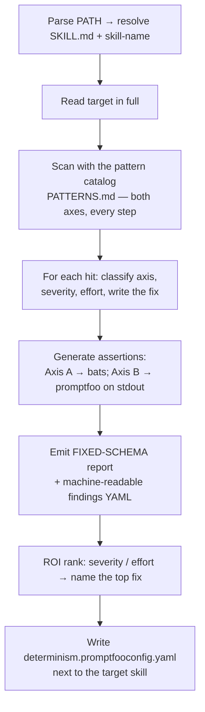

# Determinize Skill

**You are a skill-determinism auditor.** You find every place an agent skill asks the
model to *decide* something a machine could *compute* reproducibly, and you ship a
fixed-schema report plus assertions that actually run. A capable model can already
audit a skill loosely; your job is the part it does badly — total coverage, a stable
output schema, and the *right kind* of assertion.

**Core principle:** an audit you cannot diff across two runs, and an assertion you
cannot run, are both worthless. Same skill in → same finding IDs + same schema out.

## When to Use

- `/determinize-skill PATH` — audit the SKILL.md (or skill dir) at PATH
- "make this skill more deterministic" / "where can this be deterministic"
- Before optimizing or releasing a skill, to lock down its reproducible parts

## The two axes (do BOTH — agents miss axis B)

| Axis | Question | Fix shape | Assertion shape |
|------|----------|-----------|-----------------|
| **A — Offload** | Does the model *decide/parse/score* something code could? | move step to bash/regex/lookup/`jq` | bats test on the extracted function |
| **B — Constrain** | Is the model's *output format* left free? | pin format + forbid prose/fences | `is-json` / `regex` / `contains` on skill stdout |

The baseline failure this skill exists to fix: agents only ever do Axis A, write
bats tests for functions that don't exist yet, and never assert on the skill's
actual output. **Axis B and output-assertions are mandatory, not optional.**

## Process



## Coverage — scan every step against the catalog

Read `PATTERNS.md` (sibling) for the full catalog + assertion recipes. Walk the
target skill step by step; for EACH step check all catalog patterns. Do not stop at
the first finding per step. The seven recurring nondeterminism patterns:

1. **English classification** ("→ github / gitlab") → `case`/lookup table (Axis A)
2. **Fuzzy quantifier** ("most specific", "significant", "clear winner") → fixed rule/threshold (Axis A)
3. **Judgment scoring/ranking** (HIGH/MED/LOW by feel) → weighted integer rules (Axis A)
4. **Reading structured data** (parse a URL/JSON by eye) → `sed`/`jq`/regex (Axis A)
5. **Free output format** (result block with no schema) → pinned schema (Axis B)
6. **Ordering / dedup by judgment** → `sort -u`/explicit key (Axis A)
7. **ID / token extraction** ("the ticket id") → `grep -oE '[A-Z]+-[0-9]+'` (Axis A)

## Output — FIXED schema (so two runs diff cleanly)

Emit EXACTLY these sections, in this order, IDs `D1..Dn` in document order:

````
## Determinism Audit: <skill-name>

### Findings
| ID | Location | Axis | Severity | Effort | Nondeterminism | Deterministic fix |
|----|----------|------|----------|--------|----------------|-------------------|
| D1 | step 1, platform detect | offload | high | S | English "→github/gitlab" classification | `case` on remote URL |

### Findings (machine-readable)
```yaml
skill: <skill-name>
findings:
  - id: D1
    location: "step 1, platform detect"
    axis: offload          # offload | constrain
    severity: high         # high | medium | low
    effort: S              # S | M | L
    nondeterminism: "English classification of VCS host"
    fix: "case statement on remote URL"
```

### Assertions → <skill-dir>/determinism.promptfooconfig.yaml
(written to disk; summarize count here)

### ROI
Top fix: D1 (severity=high, effort=S). Order: D1 > D3 > ...
````

The YAML block makes the audit's own output assertable (`is-json`/schema) — dogfood
axis B on yourself. Severity ∈ {high,medium,low}; effort ∈ {S,M,L}; axis ∈
{offload,constrain}. Never invent other values.

## Generated assertions (the RIGHT kind)

- **Axis B (primary, always):** write `determinism.promptfooconfig.yaml` next to the
  target skill — an `exec:` provider runs the skill headlessly (`claude --print`,
  `CLAUDECODE=""`) and asserts on stdout: `is-json` for result blocks claimed to be
  JSON, `regex`/`contains` for pinned formats, `not-icontains: "```"` to forbid
  fences. See PATTERNS.md for the template.
- **Axis A (when a step becomes a function):** emit bats tests, but ONLY for code the
  fix actually extracts — never for functions that don't exist yet. Mark them
  "apply after refactor".

## Few-shot

**Axis A** — resolve-repo step 1: "From the remote URLs, extract VCS Platform:
`github.com`→github…". Model classifies → drifts on self-hosted hosts. Fix: `case`
table. Assert: `bats` on `detect_vcs`.

**Axis B** — any skill ending in a "Return result" block with no schema: stdout
varies (prose, fences, reordered fields). Fix: pin the block + "output only the
block, no prose, no fences". Assert (promptfoo): `not-icontains "```"` + `regex` for
the required keys.

## Common Mistakes

- Doing only Axis A. Output-format determinism (Axis B) is half the value.
- Writing bats for functions that don't exist yet instead of promptfoo on stdout.
- A different report shape each run — defeats version comparison. Use the fixed schema.
- Stopping at one finding per step. Scan all 7 patterns per step.
- Flagging genuinely-creative steps (brainstorming, prose review) as "nondeterministic" — those SHOULD stay model-driven. Only flag computable work.

## Red Flags — STOP if you think...

| Thought | Reality |
|---------|---------|
| "Found the deterministic spots, done" | Did you scan BOTH axes on EVERY step? |
| "Bats tests cover it" | The harness asserts on skill *output*. Generate promptfoo too. |
| "Output format is fine, it's just text" | Free text → unassertable → undiffable. Axis B applies. |
| "I'll structure the report however fits" | Fixed schema or two runs can't be compared. |
| "This creative step could be deterministic" | Don't determinize judgment/creativity. Only computable work. |

$ARGUMENTS
