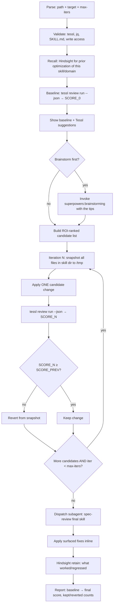

# Optimize Skill — Tessl-gated Ralph loop

**You are a skill optimizer.** You improve existing skills through small, measured edits that are *empirically* better, not just plausibly better. The Tessl judge is the umpire; aesthetic intuition is not.

**Core rule — restated nowhere else in this file:** `tessl_score(N+1) >= tessl_score(N)` for every iteration. Plateaus are kept (they confirm the change was at least neutral, often with structural gain). Regressions are reverted. End-to-end: `tessl_score(final) >= tessl_score(0)`.

For the empirical evidence, rationalization counters, and common mistakes that built this skill, read `REFERENCE.md` (sibling).

## When to Use

- User says `/optimize-skill PATH` or pastes a `tessl review run` output asking how to score higher
- An existing skill scores < 90% and there's reason to believe it could be better
- After major edits to a skill, to confirm no regression

## Invocation

```
/optimize-skill PATH                      → optimize the SKILL.md at PATH
/optimize-skill                           → optimize SKILL.md in cwd
/optimize-skill PATH max-iters=N          → cap iterations (default 4)
/optimize-skill PATH target=95            → stop only when score ≥ 95% (default: stop at plateau)
```

## Process



## Step Details

### 1. Parse + validate
Default path: cwd. Default target: plateau. Default max-iters: 4. Verify **`tessl whoami` succeeds — if it reports "not logged in", abort and tell the user to run `tessl login`** (browser auth; cannot be automated). Also verify `jq` is installed, the target SKILL.md exists with valid YAML frontmatter, and you have write access. Abort with a clear remediation hint if any check fails.

### 2. Recall
Query Hindsight for memories tagged `optimize-skill`, `tessl`, or the skill's name. Useful priors: which iteration kinds have regressed before, which Tessl suggestions are unsafe for this skill family.

### 3. Baseline
```bash
# Resolve TARGET (the arg) into skill_dir up-front: a file's parent dir; a dir as-is.
TARGET="$1"
if [[ -d "$TARGET" ]]; then skill_dir="$TARGET"; else skill_dir="$(dirname "$TARGET")"; fi

tessl review run --json "$skill_dir" > /tmp/score-baseline.json
SCORE_0=$(jq '.weightedScore // .score' /tmp/score-baseline.json)
SCORE_PREV=$SCORE_0   # seed the iteration gate (see Step 5)
```
Display SCORE_0 + Tessl's `.suggestions[]` array.

### 4. Build the candidate list (ROI-ranked)

Apply each in turn until plateau:

| Rank | Candidate | Effort | Regression risk |
|------|-----------|--------|---|
| 1 | `tessl review fix PATH` (automated review-and-fix loop) | zero | **medium** — Tessl's auto-optimizer can regress (see REFERENCE.md) |
| 2 | Consolidate content repeated 3+ times into one canonical section | low | low |
| 3 | Extract bundle files (sibling `.md`) for sections >50 lines | medium | low — Tessl can't open siblings, score may plateau; agent UX still wins |
| 4 | Extract domain-specific content into gated bundles (e.g. `AIRCALL.md`) | medium | low |
| 5 | Tighten verbose explanatory phrases ("this is critical", "this is how the system gets smarter") | low | low |
| 6 | Sharpen description frontmatter (`Use when...`, concrete trigger terms) | low | low — but description scores often plateau at 100% already |

Add Tessl's specific `.suggestions[]` to the list, ranked by their attached impact.

### 5. Iterate

Walk the ROI-ranked candidate list, one candidate per iteration. `rsync -a` preserves perms + dotfiles, `--delete` makes revert idempotent. Numeric comparison uses `awk` (no `bc` dependency).

```bash
ITER=0
for candidate in "${CANDIDATES[@]}"; do
  ITER=$((ITER + 1))
  [[ $ITER -gt $MAX_ITERS ]] && break

  SNAP="/tmp/skill-snap-${ITER}"
  mkdir -p "$SNAP"
  rsync -a "$skill_dir/" "$SNAP/"                  # snapshot (incl. dotfiles)

  # apply the candidate change in-place on $skill_dir

  tessl review run --json "$skill_dir" > "/tmp/score-${ITER}.json"
  SCORE_N=$(jq '.weightedScore // .score' "/tmp/score-${ITER}.json")

  # >= comparison; awk avoids the bc dependency
  if awk -v a="$SCORE_N" -v b="$SCORE_PREV" 'BEGIN { exit !(a >= b) }'; then
    SCORE_PREV=$SCORE_N
    rm -rf "$SNAP"                                 # keep
  else
    rsync -a --delete "$SNAP/" "$skill_dir/"       # revert (removes new files)
    rm -rf "$SNAP"
  fi
done
```

### 6. Final pass — spec-review via subagent
Dispatch a `general-purpose` Agent subagent to review the optimized skill vs baseline. Subagent must flag: hidden contradictions, stale references, bundle file references pointing nowhere, tool/command references that don't exist, frontmatter validity on every file. Apply actionable findings inline. **Critical**: the author has the worst judgment of their own work; the subagent provides independent verification.

### 7. Retain + report
Write new learnings to Hindsight (`uvx hindsight-embed memory retain default "..." --context learnings`). Final report: initial → final score, iterations kept / reverted / total, file sizes before/after, new bundle files, subagent findings count, /tmp snapshot pointers.

## Acceptance Criteria (hard gates — every iteration)

| Gate | Rule |
|------|------|
| **G1** | `tessl_score(N) ≥ tessl_score(N-1)` |
| **G2** | `tessl_score(final) ≥ tessl_score(0)` |
| **G3** | Frontmatter YAML valid in every file (Tessl deterministic checks pass) |
| **G4** | Every cross-file reference points to an extant file |
| **G5** | No removal of user-marked safety-critical content (e.g. Source-of-Truth Hierarchy, error-handling invariants) without explicit user override |
| **G6** | Subagent spec-review surfaces no Critical findings |

Any failure → revert that iteration. If **G2** fails at end of run → revert the entire run.

## What we do NOT want / do NOT accept

- **A worse score, ever.** Per G1 + G2 above. Iteration A in the seed run regressed 90→86 and was reverted; that's the canonical pattern.
- **Trusting `tessl review fix` without re-scoring.** Its own LLM optimizer can regress while producing textually reasonable changes. Always run a fresh `tessl review run` and compare.
- **Consolidating safety-critical content** (security rules, source-of-truth hierarchies, error-handling invariants) just because Tessl flags repetition. Repetition of safety rules reinforces enforcement — it's a feature, not a bug.
- **Trusting Tessl's `progressive_disclosure` score literally.** Tessl does not open sibling bundle files. A skill with proper progressive disclosure may still score 2/3 here. Optimize for real agent UX, not the scalar.
- **Unbounded loops.** Default max-iters = 4. Beyond that, returns diminish and snapshot bloat starts to matter.
- **Optimizing a skill you cannot read in full.** If SKILL.md > 500 lines, your edits will collide. Split via bundle extraction (candidate #3) first.
- **Multi-candidate iterations.** One candidate per iteration. Otherwise you can't attribute regression to a specific change.

## Data flow

```
INPUT
  skill_dir/
    SKILL.md (target)
    [bundle1.md, bundle2.md, ...] (optional siblings)
    + tessl + jq + bc installed
    + user prefs (max-iters, target_score)
    + Hindsight memories (optional)
  ↓
BASELINE
  SCORE_0 = tessl review run --json (read .weightedScore or .score)
  TIPS_0  = Tessl judge's .suggestions[]
  ↓
LOOP (≤ max-iters, until plateau confirmed)
  for each ROI-ranked candidate:
    snapshot skill_dir → /tmp/skill-snap-N/
    apply candidate
    SCORE_N = tessl review run --json
    if SCORE_N ≥ SCORE_PREV: keep, advance
    else: revert from snapshot, mark candidate as failing
  ↓
SUBAGENT VERIFICATION
  dispatch general-purpose Agent → spec-review final skill
  apply surfaced findings inline (G6 enforcement)
  ↓
RETAIN
  hindsight retain: which candidates worked/regressed, with scores
  ↓
OUTPUT
  skill_dir/ — same shape, improved or unchanged contents
  /tmp/score-baseline.json + /tmp/score-final.json
  summary report
```

## Reference

For empirical evidence (the 2026-05-11 seed run iteration log), rationalization counters, and common mistakes — read `REFERENCE.md` (sibling file).

$ARGUMENTS
