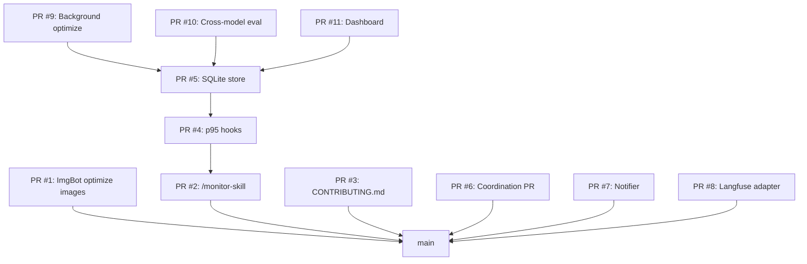

# v1.0 PR Merge Strategy

## Context

11 PRs from the v1.0 autonomous run (April 15) are all still open. Some have dependency chains (PRs #9, #10, #11 are based on PR #5). A clear merge order is needed to avoid conflicts.

## Merge Order (Dependency-Aware)

### Wave 1 (Independent - merge in any order)
1. PR #1 - ImgBot image optimization
2. PR #2 - /monitor-skill
3. PR #3 - CONTRIBUTING.md
4. PR #7 - Non-disruptive notifications
5. PR #8 - Langfuse adapter

### Wave 2 (After PR #2 merged)
6. PR #4 - p95 hooks (depends on monitor-skill)

### Wave 3 (After PR #4 merged)
7. PR #5 - SQLite store (depends on p95-hooks)

### Wave 4 (After PR #5 merged)
8. PR #9 - Background optimizer
9. PR #10 - Cross-model eval
10. PR #11 - Dashboard

### Final
11. PR #6 - Coordination (task status updates)

## Notes

- PRs in Wave 1 are fully independent and MERGEABLE
- PRs #5, #9, #11 show UNKNOWN mergeability due to branch dependencies
- After each wave, later PRs may need rebasing
